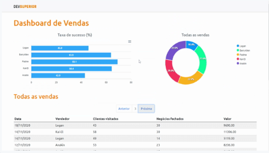

<p align="center"> 
  
  <a href="https://github.com/driica">
    
  </a>
  
<p>

<p align="center">
 <a href="#movie_camera-demonstração">Demonstração</a> •
 <a href="#information_source-sobre">Sobre</a> •
 <a href="#memo-tarefas">Tarefas</a> •
 <a href="#dvd-executar">Executar</a> •
 <a href="#hammer-tecnologias">Tecnologias</a> •
 <a href="#boy-autor">Autor</a> •
 <a href="#page_facing_up-licença">Licença</a>
</p>

---
## :movie_camera: **Demonstração**

<p align="center">
  <b> :computer: WEB </b>
</p>

<p align="center">
  <kbd>
    
  </kbd>
</p>

---
## :information_source: Sobre

Este projeto foi desenvolvido em uma semana no evento Semana Spring React oferecido pela [`DevSuperior`](https://devsuperior.com.br) gratuitamente em 3 aulas com a carga horária de 16 horas.

Utiliza React para navegação e componentização do frontend com apoio de bibliotecas para o design e criação de gráficos dinâmicos.

O backend foi desenvolvido utilizando o [`Spring Tool Suite 4`](https://spring.io/tools), banco de dados H2 para desenvolvimento e o Postgres em produção.

---
## :memo: **Tarefas**

<div align="center">

|Estado|Tarefa|
|:---:|:---:|
|:heavy_check_mark:|Criar projetos backend e frontend|
|:heavy_check_mark:|Salvar os projeto no Github em monorepo|
|:heavy_check_mark:|Montar o visual estático do frontend|
|:heavy_check_mark:|Publicar o frontend no Netlify|
|:heavy_check_mark:|Modelo de domínio|
|:heavy_check_mark:|Estruturar o backend no padrão camadas|
|:heavy_check_mark:|Consulta paginada de vendas|
|:heavy_check_mark:|Consultas agrupadas para gráficos|
|:heavy_check_mark:|Implantação na nuvem|
|:heavy_check_mark:|Integrar backend e frontend|

</details>
</div>

---
## :dvd: **Executar**

Para executar esse projeto você precisa clonar ou [`baixar`](https://github.com/rafaelfachinelli/DSVendas/archive/main.zip) este repositório, ter o Gerenciador de Pacotes do Node ([`NPM`](https://www.npmjs.com/get-npm)) ou o Gerenciador de Pacotes YARN ([`YARN`](https://yarnpkg.com/getting-started)) instalado.

### :globe_with_meridians: **Frontend**

Entre na pasta [`frontend/`](frontend/) e execute os seguintes comandos no terminal:

<details>
  <summary><i>with <b>npm</b></i></summary>
  
  ```bash
  # Instalar dependências
  $ npm install

  # Iniciar servidor de desenvolvimento
  $ npm start
  ```
  
</details>

<details>
  <summary><i>with <b>yarn</b></i></summary>

```bash
# Instalar dependências
$ yarn

# Iniciar servidor de desenvolvimento
$ yarn start

```

</details>

> ⚠️ O servidor de desenvolvimento iniciará na porta 3000 - Acesse <http://localhost:3000>

### :file_cabinet: **Backend**

Para o backend é recomendado utilizar o [`Spring Tool Suite 4`](https://spring.io/tools) selecionando a pasta [`backend/`](backend/) para adicionar ao workspace da IDE e startar a aplicação.

> ⚠️ O servidor iniciará na porta 8080 - Acesse <http://localhost:8080>

---
## :hammer: **Tecnologias**

As seguintes ferramentas foram utilizadas na construção do projeto:

<div align="center">

|:globe_with_meridians: Frontend|:file_cabinet: Backend|
|:---:|:---:|
|[React](https://reactjs.org)|[JAVA](https://www.java.com)|
|[Bootstrap 5.0](https://getbootstrap.com)|[Spring Boot](https://spring.io/projects/spring-boot)|
|[Typescript](https://www.typescriptlang.org)|[H2](https://www.h2database.com/html/main.html)|
|[date-fns](https://date-fns.org)|[Postgres](https://www.postgresql.org)|
|[apexcharts](https://apexcharts.com)||
|[axios](https://axios-http.com)||

</div>

---

### [](https://github.com/driica/DSvendas#--autor) 💎 Autor 


---
## :page_facing_up: **Licença**

<div align="center">
  
<p>Copyright © 2022 <strong>Adriana Beatriz.</strong></p>

</div>
